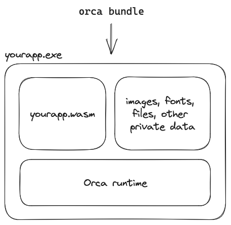

# Quick Start

This is a short introduction to developing an application that can be run by the Orca runtime. We'll present the basic structure of an Orca application, and walk through a simple example in C.

## What is an Orca app?

An Orca app is a WebAssembly module designed for the Orca runtime. Your app interacts with the Orca runtime via WebAssembly imports and exports. For example, you can import functions from the Orca runtime to get user input, and export functions to the Orca runtime to draw to the screen.

You can, in principle, write an Orca app in any programming language that supports WebAssembly. However, at this early stage, C is the only officially supported language.

Orca also ships with a core library which facilitates interaction with the Orca runtime and provides features like UI. It also ships with a C standard library implementation designed to work on WebAssembly. These libraries should be linked to your app as part of producing your WebAssembly module. You can get the paths to these libraries by running `orca sdk-path`:

- The Orca core library is located in `$(orca sdk-path)/bin`
- The Orca lib C root is located in  `$(orca sdk-path)/orca-libc` 


For example, here's how we build the WebAssembly module for our Breakout example app:

```
ORCA_DIR=$(orca sdk-path)

wasmFlags=(--target=wasm32 \
  -mbulk-memory \
  -g -O2 \
  -Wl,--no-entry \
  -Wl,--export-dynamic \
  --sysroot "$ORCA_DIR"/orca-libc \
  -I "$ORCA_DIR"/src \
  -I "$ORCA_DIR"/src/ext)

clang "${wasmFlags[@]}" -L "$ORCA_DIR"/bin -lorca_wasm -o module.wasm src/main.c

```

Once you have compiled your WebAssembly module, you can bundle this module into an executable using the `orca bundle` command. The application bundle can include images, fonts, or any other private data that the app needs in order to function. These files can be read or written from the app without asking the user for permission. The resulting Orca executables are therefore self-contained.



For example here's how we bundle the breakout example app:

```
orca bundle --name Breakout --icon icon.png --resource-dir data module.wasm
```

## Basic structure

Orca exposes a number of types and functions to applications. In order to use them the first thing to do is to include `orca.h`.

```c
#include<orca.h>
```

The Orca runtime manages the application's window and event loop. In order to receive a specific kind of event, you can define an associated _event handler_ and export it to the runtime. For instance, to be notified when your application's window is resized, you should define the `oc_on_resize()` handler:

```c
ORCA_EXPORT void oc_on_resize(u32 width, u32 height)
{
	// handle the window resize event
}
```

The `ORCA_EXPORT` macro makes the handler visible to the Orca runtime, which automatically binds it to the window resize event.

Handlers are optional. If you don't care about an event, you can just omit the associated handler. However, you will almost certainly want to define at least two important handlers:

- `oc_on_init()` is called once when your application starts and can be use to initialize your application's resources.
- `oc_on_frame_refresh()` is called when your application needs to render a new frame, typically tied to the refresh rate of the monitor.

For a list of available handlers and their signatures, see the [app cheatsheet](../doc/cheatsheets/cheatsheet_app.h).


## Clock example

Let's look at the [clock example](../samples/clock). This is a simple app that shows an analog clock and showcases a couple of interesting Orca APIs.

Open [`main.c`](../samples/clock/src/main.c) and look at the definition of `oc_on_init()`. This handler is called when the application starts, right after the application window has been created.

The first thing we do here is set the title and dimensions of the window. We then create the graphics resources that we'll use to draw the clock onto the window.

```c
ORCA_EXPORT void oc_on_init(void)
{
    oc_window_set_title(OC_STR8("clock"));
    oc_window_set_size((oc_vec2){ .x = 400, .y = 400 });
    // ...
}
```

### Graphics surfaces

Orca apps can create several _graphics surfaces_. A surface represents a destination you can draw into using a specific API. In this sample, we're going to use the canvas API, which allows drawing with a 2D vector graphics API. Other samples use a GLES surface to draw with the OpenGL ES API.

We first create a _canvas renderer_. From that renderer we can then create a _graphics surface_ compatible for drawing 2D vector graphics.  

```c
oc_surface surface = { 0 };
oc_canvas_renderer renderer = { 0 };
oc_canvas_context context = { 0 };

ORCA_EXPORT void oc_on_init(void)
{
    // ...
    renderer = oc_canvas_renderer_create();
    surface = oc_canvas_surface_create(renderer);
    // ...
}
```

### Canvas

After creating the surface, , we create a _canvas context_. A canvas holds some context for drawing commands, like the current color or stroke width, as well as a command buffer that records all drawing commands. All canvas drawing functions use an implicit _current canvas_. You can select a canvas to be the current canvas by calling `oc_canvas_select()`, as seen at the begining of `oc_on_frame_refresh()`.

Canvas drawing functions like `oc_fill()` or `oc_stroke` merely add to the current canvas command buffer. You can later render those commands onto a canvas surface by calling `oc_render()`.

To summarize, the general structure of canvas drawing code is like the following:

```c
ORCA_EXPORT void oc_on_frame_refresh(void)
{
    oc_canvas_context_select(context); // make the canvas current

    //... add commands to the canvas command buffer using drawing functions

    oc_canvas_render(renderer, context, surface); // render the canvas commands into the surface
    oc_canvas_present(renderer, surface); // display the surface
}
```

### Drawing

Canvas drawing functions can be roughly divided into three groups:

- Path functions like `oc_line_to()` or `oc_cubic_to()` are used to specify paths using lines and curves.
- Attribute setup functions like `oc_set_color()` or `oc_set_width()` are used to set attributes used by subsequent commands.
- Command functions like `oc_stroke()` and `oc_fill()` encode commands into the canvas command buffer using the current path and attributes.

Some helpers combine a path specification and a command, like `oc_circle_fill()`.

As an example, the back of the clock is drawn using these two calls:

```c
oc_set_color_rgba(1, 1, 1, 1);
oc_circle_fill(centerX, centerY, clockRadius);
```

For a list of canvas drawing functions, see the [graphics API documentation](https://docs.orca-app.dev/api/Graphics/Canvas%20API/).


#### Transforms

A special case of attribute setting function is the pair `oc_matrix_multiply_push()` and `oc_matrix_pop()`, which are used to manipulate a stack of transform matrices:

- `oc_matrix_multiply_push()` multiplies the matrix currently on top of the stack with its argument, and pushes the result on the stack.
- `oc_matrix_pop()` pops a matrix from the stack.

The matrix on the top of the stack at the time a command is encoded is used to transform the path of that command.

You can see an example of using transform matrices when drawing the clock's hands:

```c
// hour hand
oc_matrix_multiply_push(mat_transform(centerX, centerY, hoursRotation));
{
    oc_set_color_rgba(.2, 0.2, 0.2, 1);
    oc_rounded_rectangle_fill(0, -7.5 * uiScale, clockRadius * 0.5f, 15 * uiScale, 5 * uiScale);
}
oc_matrix_pop();
```

### Fonts and text

Going back to `oc_init()`, after creating a surface and a canvas, we create a font that we will use to draw the numbers on the clock's face:

```c
oc_unicode_range ranges[5] = {
    OC_UNICODE_BASIC_LATIN,
    OC_UNICODE_C1_CONTROLS_AND_LATIN_1_SUPPLEMENT,
    OC_UNICODE_LATIN_EXTENDED_A,
    OC_UNICODE_LATIN_EXTENDED_B,
    OC_UNICODE_SPECIALS
};

font = oc_font_create_from_path(OC_STR8("/segoeui.ttf"), 5, ranges);
```

The font is loaded from a font file located in a data folder inside the app bundle. By default, Orca apps use this data folder as their "root" for file operations.

Along with the path of the font file, we pass to the creation function the unicode ranges we want to load.

We then use the font to draw the clock's face:

```c
// clock face
for(int i = 0; i < oc_array_size(clockNumberStrings); ++i)
{
    oc_rect textRect = oc_font_text_metrics(font, fontSize, clockNumberStrings[i]).ink;

    const f32 angle = i * ((M_PI * 2) / 12.0f) - (M_PI / 2);
    oc_mat2x3 transform = mat_transform(centerX - (textRect.w / 2) - textRect.x,
                                        centerY - (textRect.h / 2) - textRect.y,
                                        angle);

    oc_vec2 pos = oc_mat2x3_mul(transform, (oc_vec2){ clockRadius * 0.8f, 0 });

    oc_set_color_rgba(0.2, 0.2, 0.2, 1);
    oc_text_fill(pos.x, pos.y, clockNumberStrings[i]);
}
```

### Logging and asserts

The runtime has a console overlay whose visiblity can be toggled on and off with `⌘ + Shift + D` on macOS, or `Ctrl + Shift + D` on Windows. Your application can log messages, warnings, or errors to that console using the following functions:

```c
void oc_log_info(const char* fmt, ...);    // informational messages
void oc_log_warning(const char* fmt, ...); // warnings, displayed in orange.
void oc_log_error(const char* fmt, ...);   // errors, displayed in red.
```

If you started the application from a terminal, the log entries are also duplicated there.

You can assert on a condition using `OC_ASSERT(test, fmt, ...)`. If the test fails, the runtime displays a message box and terminates the application.

You can unconditionally abort the application with a message box using `OC_ABORT(fmt, ...)`.

## Where to go next?

For more examples of how to use Orca APIs, you can look at the other [sample apps](https://github.com/orca-app/orca/tree/main/samples):

- [breakout](https://github.com/orca-app/orca/tree/main/samples/breakout) is a mini breakout game making use of the vector graphics API. It demonstrates using input and drawing images.
- [triangle](https://github.com/orca-app/orca/tree/main/samples/triangle) shows how to draw a spining triangle using the GLES API.
- [fluid](https://github.com/orca-app/orca/tree/main/samples/fluid) is a fluid simulation using a more complex GLES setup.
- [ui](https://github.com/orca-app/orca/tree/main/samples/ui) showcases the UI API and Orca's default UI widgets.

For a list of Orca APIs, you can look at the [API reference](https://docs.orca-app.dev/api/api_reference/).

You can also ask questions in the [Handmade Network Discord](https://discord.gg/hmn), in particular in the [#orca](https://discord.com/channels/239737791225790464/1121811864066732082) channel.
