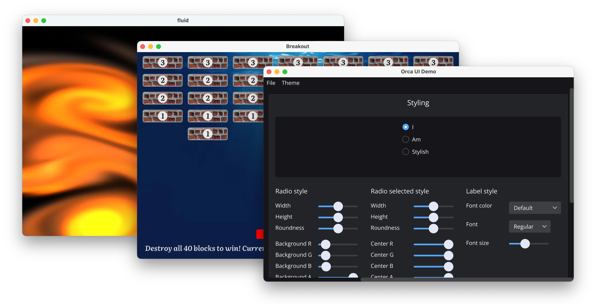

# Welcome to the Orca Documentation

Orca is a development platform and runtime environment for cross-platform, sandboxed graphical applications.

<a href="install" class="btn btn-primary" role="button">Installation</a>
<a href="QuickStart" class="btn btn-primary" role="button">Quick Start</a>

---

In this early MVP you can:

- Receive mouse and keyboard input.
- Draw paths, images and text using a 2D vector graphics API.
- Draw 2D/3D graphics using OpenGL ES 3.1 (minus a few features like mapped buffers)
- Build user interfaces using our UI API and default widgets.
- Read and write files using a capability-based API.

To learn more about the project and its goals, read the [announcement post](https://orca-app.dev/posts/230607/orca_announcement.html).

